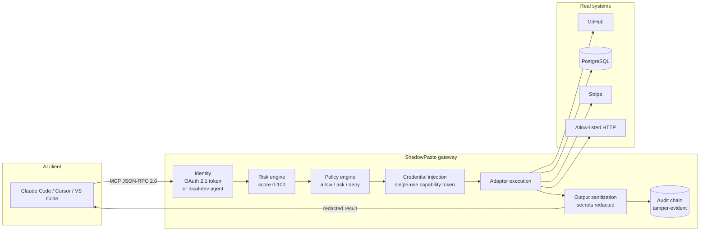
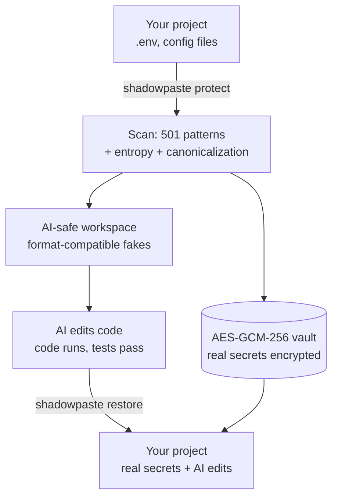
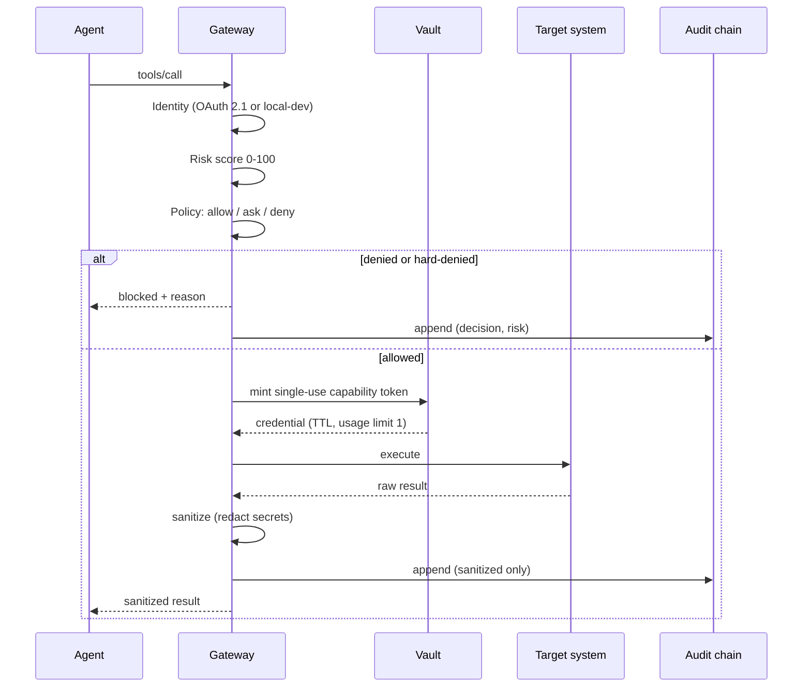

<div align="center">

# 🛡️ ShadowPaste

**Let AI code your real repo without exposing secrets.**

An AI-agent security control plane: it finds your real credentials, swaps them for
format-compatible fakes, hands the AI a safe copy, and gates every agent tool call
through a risk → policy → audit pipeline.

[](https://github.com/amitchahar509-collab/shadowpaste/actions/workflows/ci.yml)
[](https://github.com/amitchahar509-collab/shadowpaste/actions/workflows/release.yml)
[](LICENSE)
[](https://nextjs.org)
[](https://modelcontextprotocol.io)

[Quick Start](#quick-start) · [MCP Setup](#mcp-client-setup) · [Security Model](#security-model) · [Deployment](#deployment) · [FAQ](#faq)

</div>

---

## See it block something



Not a mock-up. `scripts/record-terminal-demo.mjs` runs those four calls against a
live gateway, captures what actually comes back, and renders it — and it
**refuses to write the asset** if any of them reports `executed: true`, because a
demo asserting "these are blocked" must not be able to ship showing the opposite.
Regenerate any time with:

```bash
node scripts/record-terminal-demo.mjs --demo attack-blocked --out assets/readme/attack-blocked.svg
```

## Overview

You want Claude Code or Cursor to work on your actual project. Your actual project
has a `.env` full of live credentials. Pasting it into an agent's context means those
credentials end up in a model provider's logs, a tool call's arguments, and your
audit trail.

ShadowPaste solves this from two directions:

1. **Secret virtualization** — scan the project, encrypt every real secret into a
   local vault, and write a *format-compatible fake* in its place. The code still
   parses, tests still run, the AI still understands the shape — but the credential
   is dead. When you're done, restore the real values byte-for-byte.

2. **A zero-trust MCP gateway** — when an agent calls a tool, the call is risk-scored,
   evaluated against a policy engine, given a single-use credential, executed, and
   audited with secrets redacted from both the result and the log.

Everything runs on your own infrastructure. There is no ShadowPaste cloud.

## Key Capabilities

| Capability | What it actually does |
|---|---|
| **Secret virtualization** | 501 detection patterns across 322 providers, plus Shannon-entropy detection for unknown secrets, base64 pre-decoding, and a canonicalization ladder (percent-decode → NFKC → invisible-character removal) that catches obfuscated credentials. |
| **Byte-level restore** | Restores real secrets and copies AI edits back. Files with no secret mapping are copied byte-for-byte, so images, fonts and archives survive the round trip unchanged. |
| **Zero-trust MCP gateway** | 28 tools, each risk-scored 0–100 and policy-gated before execution. Credentials are injected at call time as single-use HMAC capability tokens. |
| **Response-side sanitization** | Tool output is re-scanned on the way back; any secret found is replaced before it reaches the agent's context *or* the audit trail. Fails closed on unparseable output. |
| **Tamper-evident audit trail** | Every action is chained: `H(n) = sha256(H(n-1) ‖ canonical(row_n))`. `GET /api/v1/audit/verify` recomputes the chain and returns 409 if it diverges. |
| **OAuth 2.1 authorization server** | PKCE S256-only, exact-match redirect URIs, single-use codes, rotating refresh tokens with family revocation on replay. No external IdP required. |
| **Alerting** | 8 rules bound to signals the system actually emits, with deduplication, cooldowns and thresholds so a tight attack loop produces one page, not 5,000. |
| **Project intelligence** | On import, detects framework, language, runtime, package manager, build tool, database, ORM, containers, IaC, CI/CD and monorepo tooling, then scores health, security, complexity and AI-readiness. |

---

## Architecture



The secret-virtualization flow is separate from the gateway and can be used on its own:



---

## Installation

**Prerequisites**

- Bun ≥ 1.3 (or Node ≥ 20)
- PostgreSQL — the Prisma provider is `postgresql`, so `DATABASE_URL` must be a
  `postgresql://` URL. Docker Compose ships one; Neon, Supabase, Render and Railway
  all work.

```bash
git clone https://github.com/amitchahar509-collab/shadowpaste.git
cd shadowpaste
bun install

cp .env.example .env         # defaults match the bundled Postgres exactly
docker compose up -d db      # …or edit DATABASE_URL to point at any Postgres
                             #    (Neon, Supabase, Render, Railway all work)

bun run db:generate          # generate the Prisma client — REQUIRED
bun run db:push              # create the schema
```

> **Do not skip `db:generate`.** Without a generated Prisma client every
> database-backed route returns a 500 whose only clue is
> `@prisma/client did not initialize yet`, which in dev is rendered as an HTML
> error page rather than JSON. `db:push` also generates the client, so if that
> command succeeded you are already covered — but run it explicitly if you are
> pointing at a database that is not up yet.

> `git` on `PATH` is optional. Clone-import uses it when present and falls back to
> the host's HTTPS tarball endpoint when it isn't (GitHub, GitLab, Codeberg, Gitea).

## Quick Start

**Protect a project, let AI work on it, restore:**

```bash
bun run cli/index.ts protect -p /path/to/your/project
```

This creates `.workspaces/<orgId>/<project>-<id>/` with fakes in place of real
secrets. Open that folder in Cursor or Claude Code, let the AI edit, then:

```bash
bun run cli/index.ts restore
```

**Or run the dashboard:**

```bash
bun run dev      # http://localhost:3000
```

### CLI commands

| Command | Description |
|---|---|
| `shadowpaste init` | Initialize ShadowPaste and scan for secrets |
| `shadowpaste protect` | Create an AI-safe workspace with fake secrets |
| `shadowpaste restore` | Restore real secrets to the source project |
| `shadowpaste status` | Show protection status |
| `shadowpaste open` | Open the workspace in Cursor / Claude / VS Code |
| `shadowpaste daemon start` | Start the background file watcher |

### Importing a project into the dashboard

| Method | How |
|---|---|
| Drag & drop a folder | Drop it on the dropzone (directories are read recursively) |
| Select a folder | **Select folder** button |
| Archive | `.zip`, `.tar`, `.tar.gz`, `.tgz` — dropped archives are extracted and scanned |
| Local path | An absolute path inside an allowed root (`SHADOWPASTE_PROJECT_ROOTS`) |
| Git clone | Public **HTTPS** URL — GitHub, GitLab, Bitbucket, Azure DevOps, Codeberg, Gitea |

> SSH URLs and private repositories are intentionally **not** supported in the web
> app — it never handles your git credentials. Clone locally, then use the local-path
> method or `shadowpaste protect`.

---

## MCP Client Setup

ShadowPaste implements MCP over Streamable HTTP and the older HTTP+SSE transport,
negotiating protocol versions `2025-06-18`, `2025-03-26` and `2024-11-05`.

### Authentication: what you need, and when

**Locally, you need nothing.** With `REQUIRE_OAUTH` unset, `/api/mcp` accepts
unauthenticated calls and attributes them to a built-in local-dev agent, so the
configs below work as written with no token.

> Note the sharp edge: an *invalid* bearer token is also accepted locally and
> silently falls back to that same local-dev agent. If you paste a made-up key
> and calls succeed, that proves nothing about your credentials. Set
> `REQUIRE_OAUTH=true` when you want the token actually enforced.

**In production, set `REQUIRE_OAUTH=true`** and the token becomes a real **OAuth
2.1 access token**. There is no separate "API key" to copy from a settings page —
clients obtain a token through the OAuth flow, either automatically (MCP clients
that support OAuth discover it from the `WWW-Authenticate` header on a 401) or
manually:

```bash
# 1. Register a client (RFC 7591)
curl -s -X POST https://<your-host>/oauth/register \
  -H 'content-type: application/json' \
  -d '{"client_name":"my-client","redirect_uris":["http://localhost/callback"]}'

# 2. Send the user to /oauth/authorize with PKCE (S256 is required), then
#    exchange the returned code at /oauth/token for an access token.
```

Discovery documents (`/.well-known/oauth-authorization-server` and
`/.well-known/oauth-protected-resource`) describe every endpoint and parameter.

### Claude Code

```bash
claude mcp add --transport http shadowpaste http://localhost:3000/api/mcp
```

For a deployment with `REQUIRE_OAUTH=true`, point it at your host instead —
Claude Code runs the OAuth flow for you:

```bash
claude mcp add --transport http shadowpaste https://<your-host>/api/mcp
```

### Cursor

`~/.cursor/mcp.json` (or **Settings → MCP → Add Server**):

```json
{
  "mcpServers": {
    "shadowpaste": {
      "type": "http",
      "url": "http://localhost:3000/api/mcp"
    }
  }
}
```

Against a deployment that requires OAuth, add the token you obtained above:

```json
{
  "mcpServers": {
    "shadowpaste": {
      "type": "http",
      "url": "https://<your-host>/api/mcp",
      "headers": { "Authorization": "Bearer <oauth-access-token>" }
    }
  }
}
```

### VS Code

`.vscode/mcp.json` in your workspace:

```json
{
  "servers": {
    "shadowpaste": {
      "type": "http",
      "url": "http://localhost:3000/api/mcp"
    }
  }
}
```

For a remote deployment, prompt for the OAuth access token instead of hard-coding it:

```json
{
  "servers": {
    "shadowpaste": {
      "type": "http",
      "url": "https://<your-host>/api/mcp",
      "headers": { "Authorization": "Bearer ${input:shadowpaste_token}" }
    }
  },
  "inputs": [
    {
      "id": "shadowpaste_token",
      "type": "promptString",
      "description": "ShadowPaste OAuth access token",
      "password": true
    }
  ]
}
```

### ChatGPT

ChatGPT connectors require a **publicly reachable HTTPS** MCP endpoint with OAuth.
ShadowPaste provides both — deploy it (see [Deployment](#deployment)), set
`REQUIRE_OAUTH=true`, and point the connector at `https://<your-host>/api/mcp`.
Discovery is served from:

- `/.well-known/oauth-protected-resource` (RFC 9728)
- `/.well-known/oauth-authorization-server` (RFC 8414)
- `/oauth/register` (RFC 7591 dynamic client registration)

> We test the OAuth and MCP endpoints against the specs and against Claude Code and
> generic MCP clients. We have not certified any specific ChatGPT connector build —
> treat this configuration as spec-compliant rather than vendor-verified.

### Verify the connection

```bash
curl -s -X POST http://localhost:3000/api/mcp \
  -H 'content-type: application/json' \
  -d '{"jsonrpc":"2.0","id":1,"method":"tools/list"}'
```

---

## API Examples

Full reference: **[docs/API.md](docs/API.md)**.

**Health, including dependency status:**

```bash
curl -s http://localhost:3000/api/health
```

**Call a tool through the gateway** (returns the policy decision, not just the result):

```bash
curl -s -X POST http://localhost:3000/api/mcp \
  -H 'content-type: application/json' \
  -d '{
    "jsonrpc": "2.0", "id": 1, "method": "tools/call",
    "params": { "name": "fs.read", "arguments": { "path": "package.json" } }
  }'
```

**Verify the audit chain** (409 if the trail was altered):

```bash
curl -s "http://localhost:3000/api/v1/audit/verify" \
  -H "Authorization: Bearer <token>"
```

**Recent alerts and traces:**

```bash
curl -s http://localhost:3000/api/v1/alerts -H "Authorization: Bearer <token>"
curl -s http://localhost:3000/api/v1/traces -H "Authorization: Bearer <token>"
```

---

## Security Model

Every tool call passes through the same pipeline. There is no path that skips it.



### Risk engine

Each tool has a base score, adjusted by call context. Scores map to levels at fixed
thresholds (`src/lib/risk.ts`):

| Score | Level |
|---|---|
| 80–100 | `critical` |
| 50–79 | `high` |
| 25–49 | `medium` |
| 0–24 | `low` |

### Policy engine

Decisions are `allow_once`, `allow_always`, `ask`, `deny`, or `blocked`
(`src/lib/policy.ts`). Evaluation order:

1. **Hard deny** — six tools are permanently denied regardless of trust score,
   approval or configuration.
2. **Trust-gated auto-allow** — low-risk reads for agents above the trust threshold.
3. **Approval queue** — high-risk calls require explicit human approval.
4. **Default deny** — anything unmatched.

Hard-denied tools: `github.repo.delete`, `db.schema.drop`, `fs.execute`,
`db.export`, `stripe.charge`, `stripe.customer.delete`.

### Supported tools

28 tools across 8 adapters (`fs`, `github`, `db`, `shell`, `network`, `stripe`,
`ai`, `shadowpaste`), by risk level:

| Level | Count | Examples |
|---|---|---|
| `low` | 9 | `fs.read`, `github.read`, `db.read`, `shadowpaste.scan` |
| `medium` | 3 | `fs.write`, `network.fetch` |
| `high` | 7 | `db.write`, `github.pr.merge`, `stripe.refund` |
| `critical` | 9 | `fs.execute`, `db.schema.drop`, `github.repo.delete`, `shell.exec` |

Live list with schemas and risk metadata: `POST /api/mcp` → `tools/list`.

### ⚠️ High-risk tool disclaimer

Several registered tools can cause **irreversible damage** if a policy is
misconfigured: repository deletion, schema destruction, database export, payment
charges, customer deletion, and arbitrary shell or filesystem execution.

- Six of them are **hard-denied** and cannot be enabled through configuration —
  editing `HARD_DENY` in source is the only way, and you should not.
- The remaining high-risk tools route to an **approval queue**. That queue is a
  policy decision, **not** container isolation. A tool you approve runs with the
  credentials you gave it, on the real system.
- Run against **test credentials and non-production data** until you have reviewed
  the policy configuration for your own environment. Stripe tools reject live keys
  unless `STRIPE_ALLOW_LIVE=true`.

### Other controls

- AES-GCM-256 vault (WebCrypto), PBKDF2-SHA256 key derivation
- HMAC-SHA256 single-use, time-limited capability tokens
- Multi-tenant isolation — queries are org-scoped and workspaces are namespaced per
  organization on disk
- SSRF defense — protocol/host allowlist plus private, loopback and cloud-metadata
  address blocking, including decimal, octal, hex and IPv4-mapped-IPv6 encodings
- Filesystem confinement with symlink resolution for every caller-supplied path
- Archive extraction bounded to 5,000 files / 100 MB, rejected from the ZIP central
  directory before anything is written
- Rate limiting on every `/api/` route with per-route presets
- Security headers (CSP / HSTS / X-Frame-Options)

### Known limitations (read before deploying)

- **Rate limits are per-instance unless Redis is configured.** The default limiter
  lives in process memory, so each serverless instance keeps its own counters. Set
  `UPSTASH_REDIS_REST_URL` and `UPSTASH_REDIS_REST_TOKEN` for global limits.
  `GET /api/health` reports which mode is live and probes the backend with a real
  `PING`.
- **The "sandbox" is a policy decision, not an isolated runtime.** Critical-risk
  calls route to an approval queue; they do not run under container isolation.
  `shell.exec` therefore refuses outright rather than pretending.
- **`db.migrate` and `ai.train` are registered but not implemented** — they return a
  structured `NOT_IMPLEMENTED` error.
- **Import size is capped twice on serverless, and the platform cap is lower.**
  A full import scans every file for secrets at a measured ~0.33 MB/s, so the app
  budgets ~9.9 MB on a 60 s deadline (100 MB self-hosted, `SHADOWPASTE_MAX_IMPORT_MB`
  overrides). But Vercel rejects request bodies over ~4.5 MB at the edge, before
  any of that runs — measured: a 4 MB upload succeeds, 5 MB returns
  `FUNCTION_PAYLOAD_TOO_LARGE`. So on Vercel a **direct upload is limited to
  ~4.5 MB**; the app's budget governs archive *expansion* and the clone path,
  where the server fetches the repository itself and no request body is involved.
  For a larger project, use clone-import or self-host.
- **Workspaces need a persistent filesystem.** On serverless hosts they are written
  to the instance's temp directory, which is per-instance and ephemeral, so a
  workspace may not survive to the next request. Set `SHADOWPASTE_WORKSPACE_ROOT` to
  a mounted volume for durable workspaces.
- **Alerts are recorded but not delivered unless a webhook is configured.** Set
  `ALERT_WEBHOOK_URL` (or the Slack/Teams variants); `GET /api/health` says plainly
  when nothing is configured.
- **No SOC 2, no SLA.** This is pre-1.0 open source, not a certified service.

Threat model and hardening checklist: **[docs/SECURITY.md](docs/SECURITY.md)**.
Reporting a vulnerability: **[SECURITY.md](SECURITY.md)**.

---

## Deployment

The repo ships a multi-stage **[Dockerfile](Dockerfile)**, a
**[render.yaml](render.yaml)** blueprint, **[vercel.json](vercel.json)** and a
**[docker-compose.yml](docker-compose.yml)**. Step-by-step instructions and per-host
caveats: **[DEPLOYMENT.md](DEPLOYMENT.md)**.

| Host | Gateway, MCP, OAuth, audit | Workspaces |
|---|---|---|
| Docker / Render / Railway / Fly | ✅ | ✅ with a mounted volume |
| Vercel / serverless | ✅ | ⚠️ ephemeral — see limitations above |

Set `REQUIRE_OAUTH=true` on any publicly reachable deployment.

### Environment variables

Annotated list: **[.env.example](.env.example)**. The ones that matter most:

| Variable | Required | Purpose |
|---|---|---|
| `DATABASE_URL` | **yes** | PostgreSQL connection string |
| `AUTH_PEPPER` | **yes in production** | Keys password hashes and session HMAC. Auth refuses to start in production without a unique value. |
| `SHADOWPASTE_MASTER_KEY` | **yes in production** | Derives the AES-GCM-256 vault key. Losing it makes vaulted secrets unrecoverable. |
| `SHADOWPASTE_VAULT_SALT` | **yes in production** | Vault key salt. Same warning. |
| `REQUIRE_OAUTH` | recommended | `true` requires a valid OAuth token on `/api/mcp` |
| `NEXT_PUBLIC_APP_URL` | recommended | Public URL for redirects and the MCP config handed to clients |
| `UPSTASH_REDIS_REST_URL` / `_TOKEN` | recommended | Global (not per-instance) rate limiting |
| `TRUST_PROXY` | recommended behind a proxy | Trust `X-Forwarded-For` for rate-limit keying |
| `SHADOWPASTE_WORKSPACE_ROOT` | recommended on serverless | Durable workspace directory |
| `SHADOWPASTE_MAX_IMPORT_MB` | optional | Import ceiling. Defaults are derived from the request deadline: ~9.9 MB serverless, 100 MB self-hosted. |
| `ALERT_WEBHOOK_URL` | recommended | Where security alerts are delivered |
| `SHADOWPASTE_PROJECT_ROOTS` | optional | Roots the local-path import may read from |
| `OPENAI_API_KEY` / `ANTHROPIC_API_KEY` / `GEMINI_API_KEY` | optional | Enables the `ai.generate` tool |
| `GITHUB_TOKEN` / `STRIPE_SECRET_KEY` | optional | Credentials for the GitHub and Stripe read tools |
| `NETWORK_ALLOWED_HOSTS` | optional | Extra hosts the network tools may reach |

---

## Troubleshooting

| Symptom | Cause and fix |
|---|---|
| 413 `project too large to import` | The app's own budget: importing scans every file (~0.33 MB/s), so the ceiling follows the request deadline — ~9.9 MB serverless, 100 MB self-hosted. Import a subdirectory, or raise `SHADOWPASTE_MAX_IMPORT_MB`. |
| 413 `FUNCTION_PAYLOAD_TOO_LARGE` | Vercel's edge rejected the body before the app ran — its request limit is ~4.5 MB. Use clone-import (the server fetches the repo, so no body is uploaded) or self-host. |
| 500 with an HTML page on `/api/health` or `/api/mcp` | The Prisma client was never generated. Run `bun run db:generate`. The underlying error is `@prisma/client did not initialize yet`. |
| `P1001: Can't reach database server at localhost:5432` | Postgres is not running. `docker compose up -d db`, or point `DATABASE_URL` at a hosted Postgres. |
| MCP calls succeed with an obviously fake token | Expected locally: unauthenticated and invalid tokens both fall back to the local-dev agent. Set `REQUIRE_OAUTH=true` to enforce tokens. |
| `Environment variable not found: DATABASE_URL` | `.env` missing or not a `postgresql://` URL. `cp .env.example .env`, then `bun run db:push`. |
| `AUTH_PEPPER` startup refusal in production | Deliberate. Set a unique value; without it sessions would be forgeable. |
| `/api/mcp` returns 401 | `REQUIRE_OAUTH=true` and no valid token. Check `WWW-Authenticate` in the response for the discovery URL. |
| Rate limits behave inconsistently | Per-instance memory limiter. Configure Upstash Redis; `GET /api/health` shows the active mode. |
| `invalid workspacePath` after an upload | The workspace directory no longer exists — usually an ephemeral serverless temp dir. Set `SHADOWPASTE_WORKSPACE_ROOT` to a mounted volume. |
| Clone fails with `git ENOENT` | No `git` on `PATH`. Clone-import falls back to HTTPS tarballs for GitHub, GitLab, Codeberg and Gitea; other hosts return 501. |
| `npm run build` fails with `EPERM` on Windows | A running dev server holds the Prisma query engine open. Stop it, then rebuild. |
| Alerts fire but nobody is notified | No delivery adapter. Set `ALERT_WEBHOOK_URL`. |

More: **[docs/TROUBLESHOOTING.md](docs/TROUBLESHOOTING.md)**.

---

## FAQ

**Does my code or my secrets go to ShadowPaste's servers?**
No. There is no ShadowPaste service. You run it; secrets are encrypted into a vault
on infrastructure you control.

**What happens if I lose `SHADOWPASTE_MASTER_KEY`?**
Vaulted secrets become unrecoverable. Both the key and the salt must be backed up
before you protect anything you care about.

**Is this a replacement for a secret manager?**
No. It keeps real credentials out of an AI's context during development, and gates
agent tool calls. Vault, AWS Secrets Manager and friends solve a different problem.

**Can the AI tell the fakes are fake?**
It can — they are labelled. The point isn't deception, it's that the code keeps the
right *shape* so it parses and runs while the credential is dead.

**Does it work with any MCP client?**
Any client speaking MCP over Streamable HTTP or HTTP+SSE. Claude Code and generic
MCP clients are tested directly; see the [ChatGPT](#chatgpt) caveat.

**Is it production-ready?**
The security controls are tested and the test suite runs in CI. It is pre-1.0 open
source with no SOC 2 and no SLA — read [Known limitations](#known-limitations-read-before-deploying)
and decide for your own risk tolerance.

---

## Video and screenshots

Scripts for the demo library live in **[docs/videos/](docs/videos/)**. Every one is
written against **[docs/videos/FACTS.md](docs/videos/FACTS.md)** — a verified-claims
sheet — and carries the exact commands to reproduce its takes, so a viewer can run
the demo rather than take it on trust.

`node scripts/video-sync.mjs` reports which scripts a code change has invalidated,
and flags separately when a number stated *on screen* has moved. It does not
re-render anything: that should be a decision, not a side effect of a commit.

> **No videos are published yet.** The scripts and the staleness tooling are in the
> repo; rendering is pending. Nothing below links to an asset that does not exist.

Screenshots are also still to be captured. These are the shots that would help most
— contributions welcome (PNG or GIF, light and dark, 1440×900):
>
> 1. **Dashboard / command center** — the landing view with live metrics
> 2. **Import Hub** — drag-and-drop folder import with the analysis result
> 3. **Secret scan result** — findings list with providers and severity
> 4. **AI-safe workspace diff** — real secret beside its format-compatible fake
> 5. **MCP gateway decision** — a blocked critical-risk call with its reason and score
> 6. **Flight recorder** — the audit timeline
> 7. **Approval queue** — a high-risk call awaiting human approval
> 8. **CLI protect → restore** — an animated GIF of the round trip

---

## Tech Stack

- Next.js 16 · React 19 · TypeScript 5 (strict)
- Prisma ORM → PostgreSQL
- Bun runtime (Node ≥ 20 also supported)
- Tailwind CSS 4 · shadcn/ui · Three.js
- WebCrypto + Node `crypto` — no external crypto dependencies

## Documentation

| Guide | |
|---|---|
| **[Usage Guide](USAGE_GUIDE.md)** | **Start here** — full feature matrix, CLI + dashboard walkthroughs, MCP setup |
| [Quick Start](docs/QUICKSTART.md) | Protect → edit → restore, end to end |
| [Installation](docs/INSTALLATION.md) | Local, Docker, and production setup |
| [Configuration](docs/CONFIGURATION.md) | Every environment variable |
| [Architecture](docs/ARCHITECTURE.md) | How the pieces fit together |
| [API Reference](docs/API.md) | Every HTTP endpoint |
| [Security](docs/SECURITY.md) | Threat model and hardening |
| [Runbook](docs/RUNBOOK.md) | Operating it: health, alerting, incidents |
| [Troubleshooting](docs/TROUBLESHOOTING.md) | Common problems |
| [Developer Guide](docs/DEVELOPMENT.md) | Build, test, project layout |
| [Deployment](DEPLOYMENT.md) | Per-host deployment guides |
| [Changelog](CHANGELOG.md) · [Roadmap](ROADMAP.md) | History and plans |

## Contributing

Contributions are welcome. Please read **[CONTRIBUTING.md](CONTRIBUTING.md)** first.

```bash
bun install
bun run db:push
bun run typecheck && bun run lint && bun run test:unit
bun run build
```

Security-relevant changes need a regression test that fails without the fix. Please
do not open a public issue for a vulnerability — see **[SECURITY.md](SECURITY.md)**.

## License

[MIT](LICENSE) © ShadowPaste contributors.
